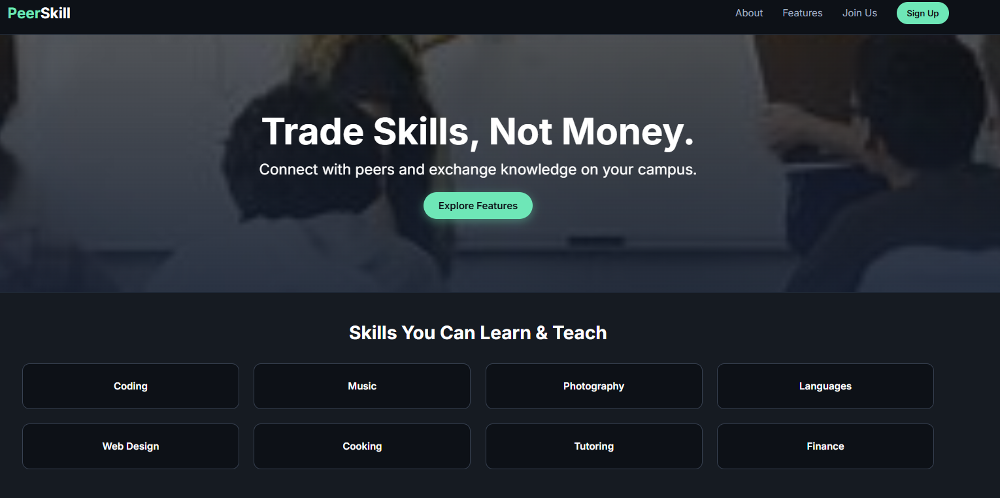
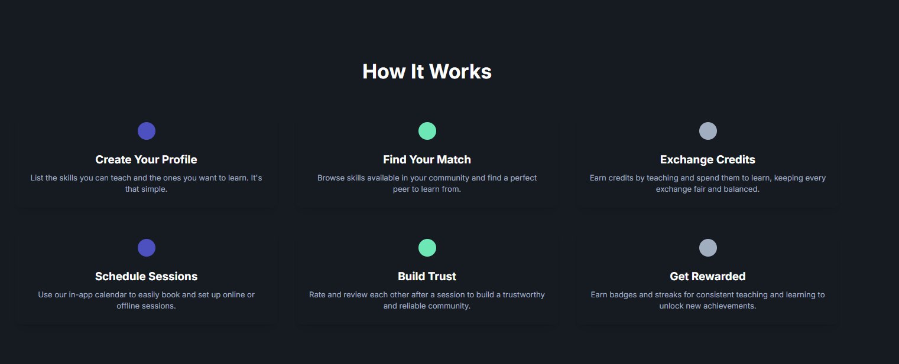
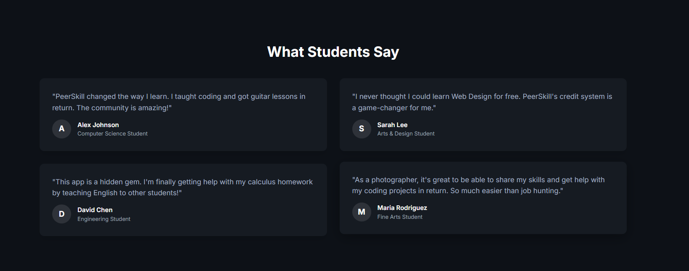

# PeerSkill

PeerSkill is a peer-to-peer skill sharing platform that connects students, professionals, and hobbyists who want to *learn, **teach, or **exchange* skills with each other. Instead of paying for expensive courses, users can directly collaborate with people who already have the skills they’re looking for.

---

## 🚀 Features
- *Skill Exchange:* Post the skills you can teach and the skills you want to learn.
- *Matching Engine:* Smart recommendations based on interests, location, and expertise level.
- *Profiles & Ratings:* Build a profile, showcase your skills, and get rated by peers.
- *Messaging System:* Secure in-app chat for planning sessions.
- *Workshops & Events:* Organize group sessions or webinars inside the platform.
- *Gamified Progress:* Earn badges and points for sharing knowledge.
-  
 
- 

---

## 🎯 Problem We’re Solving
Traditional learning platforms are one-sided (teacher → student) and expensive.  
PeerSkill solves this by enabling *mutual learning* and *knowledge barter* — making learning affordable, collaborative, and community-driven.

---

## 🧠 How It Works
1. *Create a Profile* – Add skills you can offer and skills you’re seeking.
2. *Match* – Get matched with peers based on skill needs.
3. *Connect & Learn* – Schedule 1-on-1 sessions or join group workshops.
4. *Rate & Review* – Give feedback after sessions to improve the ecosystem.

---

## 💡 Unique Ideas & Future Enhancements
- *Skill Wallet:* Track skills learned/earned like a digital portfolio.
- *AI Mentor:* Personalized learning paths based on your activity.
- *Peer Verification:* Community-driven verification for authentic skill providers.
- *Marketplace:* Optional paid services for advanced training.
- *Offline Meetups:* Location-based skill exchange events.

---
git clone https://github.com/<your-username>/PeerSkill.git
cd PeerSkill
npm install   # if using Node.js
